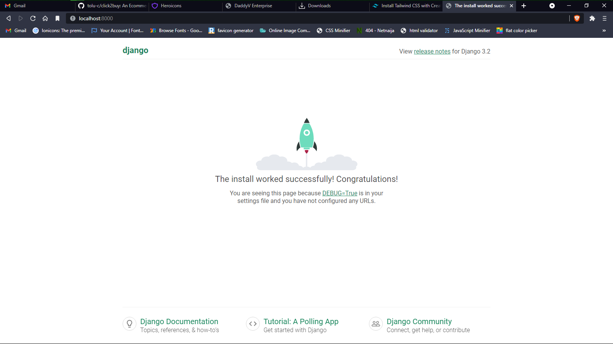

# daddyvEnterprise
A web app enabling you to purchase data online

## To install react & tailwind:
* you have to have node js installed on your system, [node js](https://nodejs.org/en/). confirm its installation by entering `node -v`, it should return the version of the node js installed
* cd to your frontend from your terminal , `cd frontend`
* install all the packages using ; `npm i`
* after installation completed, run `npm run start` or `yarn start` to open its server, it will open at [localhost:3000](http://localhost:3000)

## To install django:
* you have to have python on your system, visit [python website](https://www.python.org/). confirm if it's installed correctly using `python --version`, it'd return the version of the python installed
* create a virtual environment; `python -m venv venv`
* activate your virtual environment; `. venv/scripts/activate`
> make sure your virtual environment is activated when you're running a command in python
* install the requirements; `pip install -r requirements.txt`
* migrate your database using `python manage.py migrate`
* run the server using; `python manage.py runserver`, it'll open at [localhost:8000](http://localhost:8000)
* if it runs successfully, you should see 